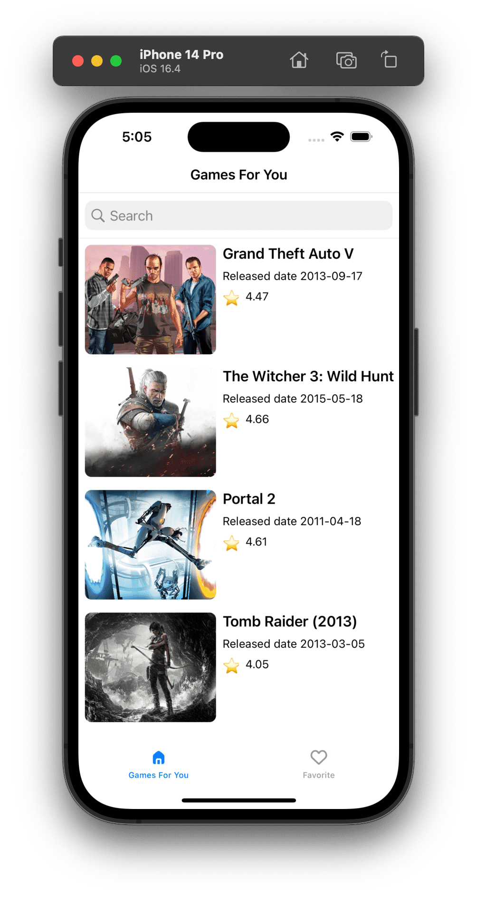
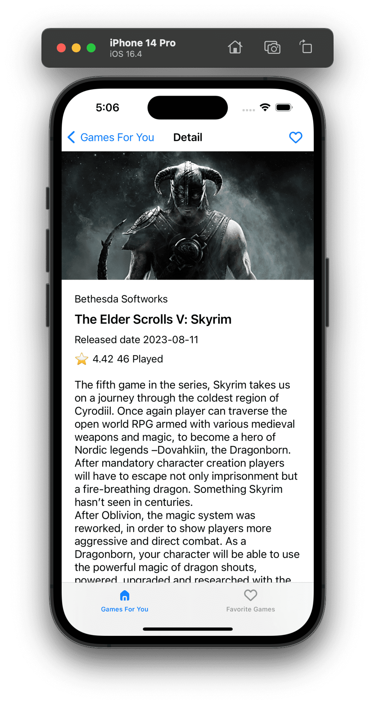
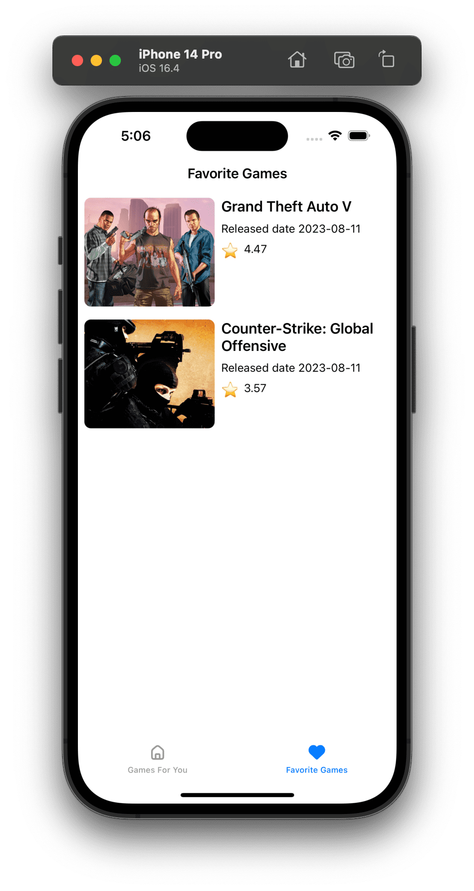

# PlayRadar: Unveiling the Gaming World through RAWG API
😀 Haha, ChatGPT detected ya?

Welcome to PlayRadar, an exceptional application designed to immerse you in the captivating realm of gaming, all powered by the RAWG API.

## A Glimpse of Features

| Game List | Detail | Favorites |
|-----------|--------|-----------|
|  |  |  |

1. **Game Listing**: Explore an extensive array of games, complete with eye-catching cover images, engaging titles, release dates, and ratings.
2. **Game Details**: Delve deep into the intricacies of your beloved games, including comprehensive publisher insights, play count statistics, and vivid game descriptions.
3. **Favorites List**: Curate your personal collection of favorites, ensuring you keep an organized track of the games you hold dear.
4. **Favorite Toggling**: Seamlessly mark and unmark games as favorites with a simple tap.

## Cutting-edge Technology Stack

PlayRadar harnesses the power of modern technologies to deliver an unparalleled user experience.

1. **Swift**: The backbone of the application, ensuring robust performance and dynamic functionalities.
2. **UIKit**: The framework that breathes life into the app's elegant user interface.
3. **SwiftUI**: Leveraged for SwiftUI previews, allowing you to experience the controller's appearance firsthand.
4. **URLSession**: Empowered to make swift and efficient network requests to the RAWG API.
5. **CoreData**: The cornerstone of the local database, expertly managing the storage of game and favorite information.
6. **XCTest**: Employed for both Unit Tests and UI Tests, meticulously validating the app's functionality.
7. **Dependency Injection**: A strategic approach that enhances testing capabilities, ensuring a sturdy and resilient application.

## A Dependency-free Journey

PlayRadar is meticulously crafted without the reliance on third-party dependencies. This not only guarantees exceptional performance but also instills maintainability and security at its core.

## Architectural Brilliance: VIPER

The architecture of the application is artfully based on the VIPER pattern. This meticulous pattern boasts a clear division of responsibilities, fostering modularization that eases maintenance and facilitates future scalability.

## Modular Modules for Elevated Excellence

The PlayRadar project is thoughtfully modularized, enhancing flexibility and cross-platform harmonization:

1. **PlayRadariOS**: The heart of the iOS app, orchestrating the captivating user interface.
2. **PlayRadarMacOS**: Safeguarding core business logic's platform independence, beckoning the world of macOS.
3. **PlayRadar**: The epicenter of core business logic, ensuring the app's functionality is as brilliant as its vision.
4. **PlayRadarRemote**: The conductor of API symphonies, orchestrating data retrieval from the RAWG API. Ready to transition to GraphQL in the future.
5. **PlayRadarLocal**: The keeper of local database treasures, ensuring seamless access to favorites and game particulars. Poised for a future transition to the Realm framework.

Feel free to embark on a journey of exploration, contribute your insights, and immerse yourself in the rich universe of gaming with PlayRadar!